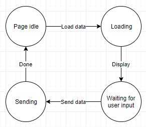

# Finite State Machine
**DISCLAIMER**: I'll be VERY surprised if any of this works in Internet Explorer - it's not designed to. Please don't open any IE related issues :)

A *Finite State Machine* is any system, that can be in exactly one of any number of predefined states, at any one time. It will transition from one state to another, depending on input. It forms the basis of most, if not all, software systems.

Think of a User class. A user may be in one of several states: *Newly created*, then transition to *Email verified*, after which the user can be *Logged in* and then *Logged out*. Let's list the states and transitions:
```
Newly created //Initial state
  Verfiy email -> Email verified

Email verified //Also logged out
  Log in -> Logged in

Logged in
  Log out -> Email verified //or Logged out
```
> Hey; you forgot the *Blocked* state.

Did I? Consider *blocked* a property, and not a state, and it will be a condition for rejecting the the *Log in* transition above (in this implementation of FSM, you return false or throw an error), causing the machine to stay in the *Email verified / logged out* state.

<hr>

Any given project likely has many FSMs. In the case of a webfront, you might have one for navigation, one or more for data retrieval, at least one for display state, and so on.

Once you start thinking about state machines, you start seeing them everywhere.

This library helps enforce correct usage of the pattern, by only making available those transitions, that are "legal" at any given time. In the user transitions above, it will, for example, be impossible to *log in* twice, without logging out first, and you can only *verify email* once.

## Definitions
A "state" is a semi-stable state of the system, that doesn't change, unless something acts on it.

A "transition" is the action, that moves the system from one state to another.

## Usage
```JS
new FSM( initial_state:string , states:object );
```
States are defined as
```JS
{
  'state 1' : {
    'transition_to_state_2' : FSM.transition('state 2', ()=>return true),
    'transition_to_state_3' : FSM.transition('state 3', ()=>return true)
  },
  'state 2' : {
    'transition_to_state_3' : FSM.transition('state 3', ()=>return true)
  },
  'state 3' : {}
}
```

Transitions are atomic - that is, they either move the FSM to a new state (by returning a truthy value) or not (returning a falsey value, or triggering an error). A transition is synchronous. If you want to do asynchronous stuff before "finalising" the transition to the new state, for example fetching remote data, then display it, you should use a "fetching" or "waiting for data" state, from which you can transition once your data is ready;



### Example

```JS
var runner = new FSM('idle', {
	'idle' : {
		//Create the 'run' method, and - upon successful execution - transition to the 'running' state
		'run' : FSM.transition('running', function() {
			console.log("I'll take a run"); 
			let fsm = this; 
			//This is a lazy runner, he'll stop after a second
			setTimeout(function(){fsm.stop('no', 'more')},1000); 
			
			//remember to return a non-falsey value, else the transition to 'running' won't happen
			return "sprinting";
		})
	},
	'running' : {
		//Create the 'stop' method, and - upon successful execution - transition to the 'idle' state
		'stop' : FSM.transition('idle', function(arg1, arg2) {
			console.log("Don't wanna run", arg1, arg2); 
			
			return true;
		})
	}
})

runner.on('state-change', (e)=>console.log(e.detail));
//Execute the 'run' transition
runner.run();
```
